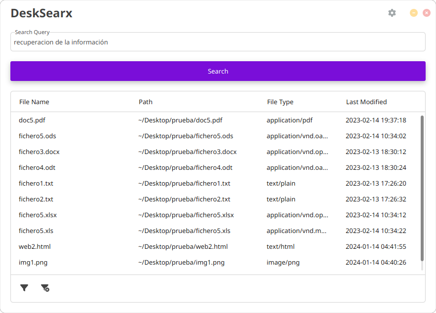

# DeskSearx 

<br />

DeskSearx is a desktop search tool powered by Apache Lucene and Apache Tika for efficient file searching on your personal computer.

This program is a work in progress, indexing is done in a single-threaded manner and the user interface might be unresponsive during the process. The selected directory paths are not indexed recursively, only the files in the root directory are indexed. DeskSearx will try to index every file it finds, no matter the file type or size.

## Features

- Index and search the content of text documents, PDFs, emails, and more.
- Real-time file system monitoring for index updates.
- Multilingual search support with language-specific analyzers (only English and Spanish are supported at the moment).
- Sleek user interface with MaterialFX styling.

<br />



## Releases

The latest release can be found in the [releases section](https://github.com/GarciaLnk/desksearx/releases) of this repository. The release includes .zip files for both Linux and Windows, containing the DeskSearx executable and a minimal JRE. An AppImage for Linux and a self-extracting .exe for Windows are also available. Finally a fat JAR is provided for those who want to run the application using their own Java runtime.

## Prerequisites

- Java JDK 21 or higher.
- (Optional) Gradle 8.5 or higher.

## Building

Clone the repository and navigate to the project directory:

```bash
git clone https://github.com/GarciaLnk/desksearx
cd desksearx
```

Build the project using Gradle:

```bash
./gradlew build
```

Run the application:

```bash
./gradlew run
```

## Usage

1. Start DeskSearx.
2. Open the settings and enter the directory paths you want to index.
3. Type your search query.
4. Press 'Search' to retrieve your results.
5. Double-click on a result to open the file.
